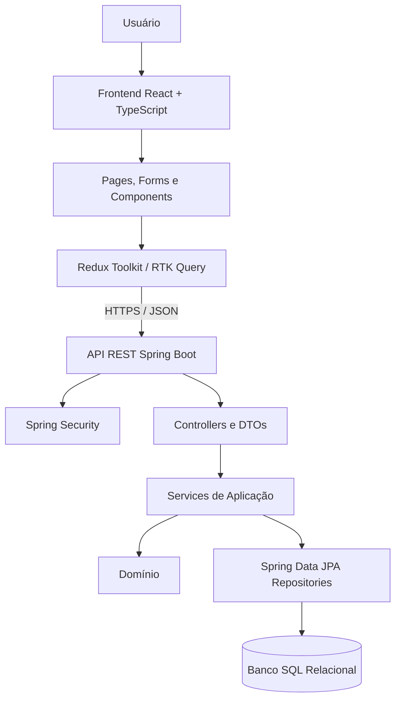
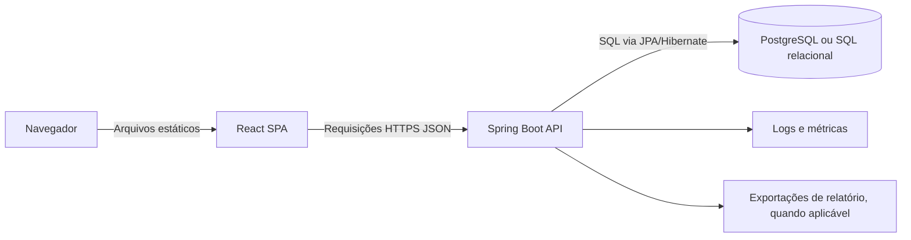
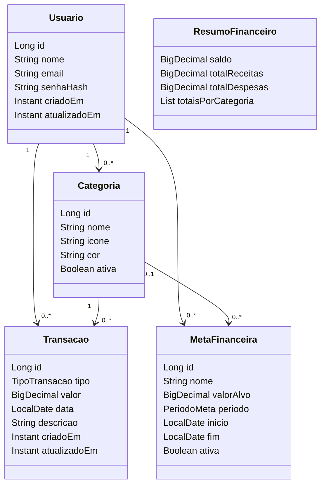
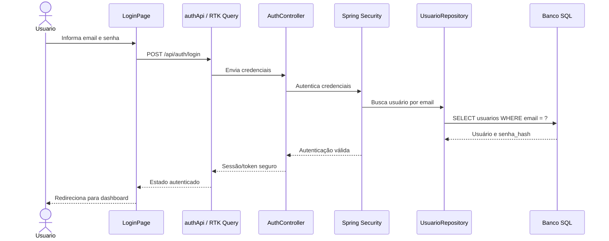
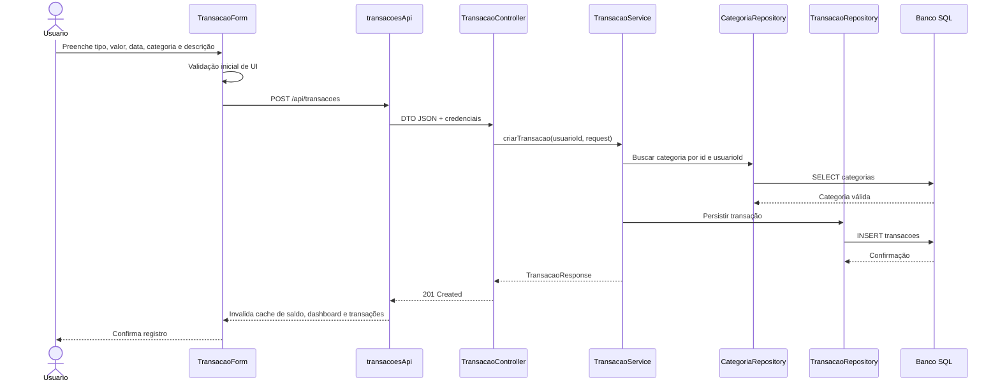
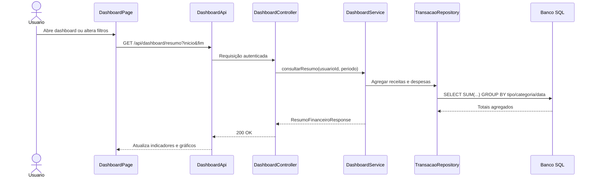
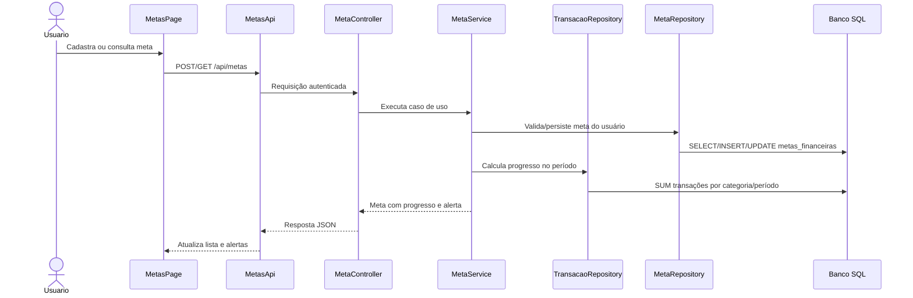
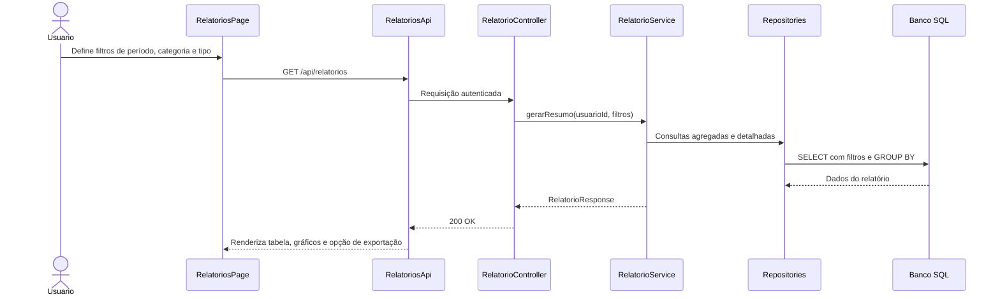
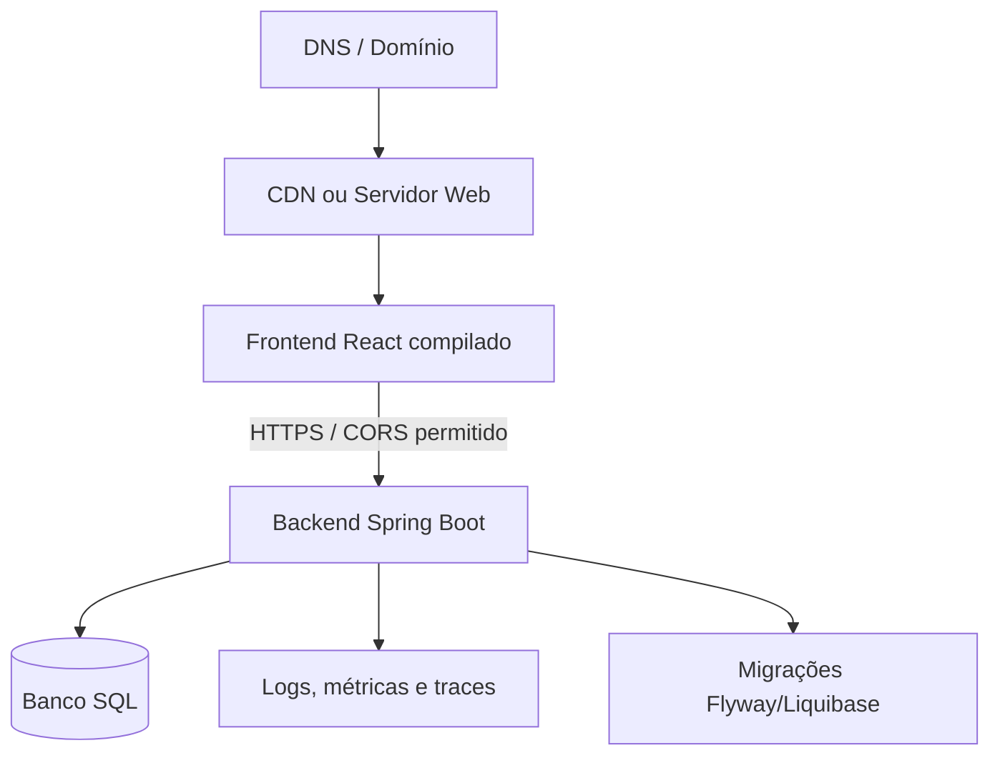
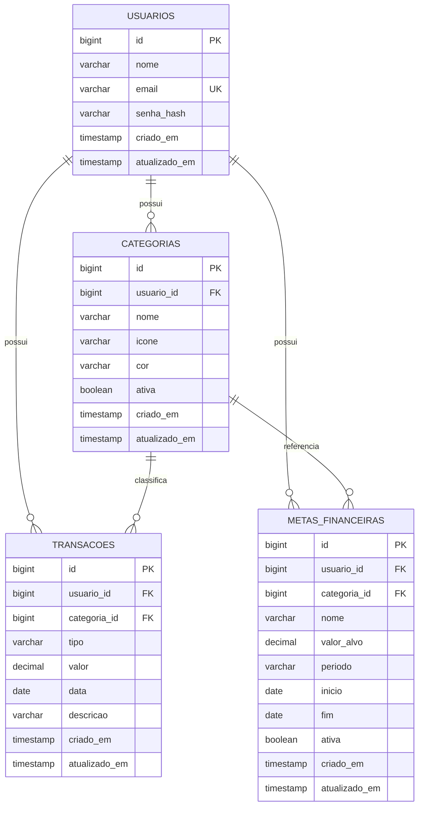

# Documento de Arquitetura do Sistema (DAS)

**Projeto:** PoupaMais  
**Versão:** 2.0  
**Data de geração:** 14 de maio de 2026  
**Documento de origem:** `Documento de Arquitetura do Sistema(DAS).odt`  
**Equipe:** Equipe de desenvolvimento

## Histórico de Revisões

| Versão | Data | Autor | Descrição |
| --- | --- | --- | --- |
| 1.0 | 05/10/2025 | Equipe de Desenvolvimento | Versão inicial baseada em SPA frontend-only, Zustand e `localStorage`. |
| 2.0 | 14/05/2026 | Equipe de Desenvolvimento | Reescrita para arquitetura em camadas com React/Redux, API Java/Spring Boot e banco de dados SQL. |

## Sumário

1. [Introdução](#1-introdução)
2. [Representação Arquitetural](#2-representação-arquitetural)
3. [Objetivos, Restrições e Premissas](#3-objetivos-restrições-e-premissas)
4. [Visão de Casos de Uso](#4-visão-de-casos-de-uso)
5. [Visão Lógica](#5-visão-lógica)
6. [Visão de Processos](#6-visão-de-processos)
7. [Visão de Implantação](#7-visão-de-implantação)
8. [Visão de Implementação](#8-visão-de-implementação)
9. [Visão de Dados](#9-visão-de-dados)
10. [Qualidade](#10-qualidade)
11. [Decisões Arquiteturais](#11-decisões-arquiteturais)
12. [Apêndices](#12-apêndices)

## 1. Introdução

### 1.1. Propósito

Este documento descreve a arquitetura do PoupaMais, uma aplicação web de controle financeiro pessoal. O objetivo é registrar as principais decisões técnicas, a organização em camadas, os componentes do frontend e backend, o modelo relacional de dados, os fluxos de execução e as diretrizes de qualidade, segurança e implantação.

A versão 2.0 substitui a arquitetura anterior, baseada em aplicação totalmente frontend com persistência em `localStorage`, por uma solução completa com frontend React/TypeScript, estado e integração via Redux Toolkit, backend Java/Spring Boot, API REST JSON e banco de dados SQL relacional.

### 1.2. Escopo

O PoupaMais contempla:

- Autenticação de usuário.
- Registro, edição, exclusão e consulta de despesas.
- Registro, edição, exclusão e consulta de receitas.
- Cadastro e manutenção de categorias.
- Dashboard com saldo, totais, estatísticas e gráficos.
- Metas financeiras por categoria ou período, com alertas.
- Relatórios e sumários por período, categoria e tipo de transação, com exportação quando aplicável.
- Validações para impedir valores inconsistentes, categorias inválidas, períodos inválidos e acesso a dados de outro usuário.

O frontend oferece a experiência de uso, formulários, gráficos, estados de carregamento e feedback visual. O backend é a autoridade para autenticação, autorização, validações críticas, regras financeiras, consistência transacional e persistência.

### 1.3. Definições e Abreviações

| Termo | Definição |
| --- | --- |
| API | Application Programming Interface. No PoupaMais, a API principal é REST sobre JSON. |
| CORS | Cross-Origin Resource Sharing, política usada para controlar chamadas do frontend para o backend em origens diferentes. |
| DTO | Data Transfer Object, objeto usado como contrato de entrada e saída da API. |
| JPA | Java Persistence API, especificação usada com Hibernate para persistência relacional. |
| MVC | Model-View-Controller, padrão usado como referência de separação de responsabilidades. |
| REST | Estilo arquitetural para exposição de recursos via HTTP. |
| Redux Toolkit | Biblioteca oficial recomendada para gerenciamento de estado Redux no frontend. |
| RTK Query | Ferramenta do Redux Toolkit para chamadas HTTP, cache, loading, erro e invalidação de dados. |
| SPA | Single Page Application, aplicação web que troca conteúdo no cliente sem recarregar páginas completas. |
| SQL | Linguagem e modelo relacional usados para persistência dos dados financeiros. |

## 2. Representação Arquitetural

### 2.1. Arquitetura em Camadas

O PoupaMais adota uma arquitetura em camadas, com separação clara entre apresentação, integração HTTP, API, aplicação, domínio, persistência e banco de dados.



| Camada | Responsabilidade |
| --- | --- |
| Apresentação | Renderizar telas, formulários, dashboard, gráficos, navegação e feedback de interação. |
| Estado e integração frontend | Controlar sessão, filtros, cache de dados, chamadas HTTP, estados assíncronos e invalidação de consultas. |
| API REST | Expor endpoints JSON para autenticação, transações, categorias, metas, saldo e relatórios. |
| Segurança | Autenticar usuários, proteger endpoints e garantir isolamento dos dados por usuário. |
| Aplicação/serviços | Executar casos de uso, regras de negócio, validações de domínio e transações de banco. |
| Domínio | Representar conceitos centrais como `Usuario`, `Transacao`, `Categoria`, `MetaFinanceira` e `ResumoFinanceiro`. |
| Persistência | Mapear entidades JPA, executar consultas, manter integridade e acessar o banco SQL. |
| Banco de dados | Armazenar dados relacionais com chaves, constraints, índices e migrações versionadas. |

### 2.2. Padrão Arquitetural

A arquitetura usa separação frontend/backend com API REST. No frontend, o padrão principal é organização por features: páginas e componentes de interface consomem hooks e endpoints definidos em slices ou services do Redux Toolkit. No backend, os endpoints seguem um fluxo Controller -> Service -> Repository -> Banco SQL.

O `localStorage` não é a fonte principal dos dados financeiros. Ele pode ser usado apenas para dados não críticos de experiência, como preferências visuais ou cache controlado, sempre considerando o backend e o banco SQL como fonte de verdade.

### 2.3. Visão Geral de Integração



O backend deve retornar respostas padronizadas para sucesso, erro de validação, autenticação expirada, acesso negado e falhas inesperadas. O frontend deve tratar esses estados de forma explícita.

## 3. Objetivos, Restrições e Premissas

### 3.1. Objetivos Arquiteturais

- Separar responsabilidades entre frontend, backend e banco de dados.
- Garantir persistência centralizada e confiável dos dados financeiros em banco SQL.
- Proteger dados por usuário autenticado, impedindo acesso cruzado entre contas.
- Manter operações financeiras críticas dentro de transações de banco.
- Permitir acesso multi-dispositivo mediante autenticação.
- Facilitar evolução com camadas testáveis e baixo acoplamento entre UI, API, domínio e persistência.
- Suportar consultas de saldo, dashboard, metas e relatórios por agregações consistentes.
- Manter uma experiência responsiva, com estados claros de carregamento, erro e sucesso.

### 3.2. Restrições Técnicas

- A aplicação depende de conexão com o backend para consultar e persistir dados financeiros oficiais.
- O navegador deve ter JavaScript habilitado e suporte a recursos modernos de SPA.
- Dados financeiros não devem ser armazenados como fonte principal em `localStorage`.
- Operações críticas precisam ser validadas no backend, ainda que o frontend também valide formulários.
- A API deve exigir autenticação nos endpoints financeiros.
- Ambientes de produção devem usar HTTPS.
- A configuração de banco, segredos, CORS e tokens deve ser externa ao código, por variáveis de ambiente ou mecanismo equivalente.

### 3.3. Premissas

- PostgreSQL é usado como referência de banco SQL, mas o desenho permanece compatível com bancos relacionais equivalentes.
- O frontend é implementado com React, TypeScript, Redux Toolkit e RTK Query ou camada equivalente.
- O backend é implementado com Java, Spring Boot, Spring Web, Spring Security, Spring Data JPA/Hibernate e Bean Validation.
- Migrações de banco são versionadas com ferramenta como Flyway ou Liquibase.
- Relatórios podem ser gerados diretamente por consultas agregadas da API ou por job assíncrono quando volume e tempo de processamento exigirem.

## 4. Visão de Casos de Uso

### 4.1. Atores

| Ator | Descrição |
| --- | --- |
| Usuário | Pessoa autenticada que controla receitas, despesas, categorias, metas, saldo e relatórios. |
| Sistema | Componentes automáticos responsáveis por validações, cálculos, alertas, agregações, persistência e auditoria técnica. |
| Administrador técnico | Papel operacional eventual para configuração, observabilidade e manutenção da aplicação, sem acesso funcional aos dados financeiros de usuários fora de políticas definidas. |

### 4.2. Casos de Uso Principais

| Código | Caso de uso | Resultado esperado |
| --- | --- | --- |
| UC01 | Registrar despesa | Uma transação do tipo `DESPESA` é validada, persistida e considerada nos saldos e relatórios. |
| UC02 | Registrar receita | Uma transação do tipo `RECEITA` é validada, persistida e considerada nos saldos e relatórios. |
| UC03 | Consultar saldo | O usuário visualiza saldo, total de receitas, total de despesas e variações por período. |
| UC04 | Cadastrar categoria | Uma categoria vinculada ao usuário é criada e pode ser usada em transações e metas. |
| UC05 | Verificar metas | O sistema calcula progresso de metas por categoria ou período e sinaliza aproximação ou estouro de limite. |
| UC06 | Gerar relatório por período | O usuário consulta ou exporta sumários por intervalo, categoria e tipo de transação. |
| UC07 | Autenticar usuário | O usuário acessa a aplicação com credenciais válidas e recebe sessão/token protegido. |

### 4.3. Regras Transversais

- Todo caso de uso financeiro deve executar no contexto de um usuário autenticado.
- Identificadores recebidos pela API devem ser verificados contra o `usuario_id` autenticado.
- Valores monetários devem ser positivos e armazenados com tipo decimal adequado.
- Datas e períodos devem ser válidos e coerentes.
- Categorias usadas em transações e metas devem existir, estar ativas quando aplicável e pertencer ao usuário.
- Falhas de validação devem produzir respostas padronizadas e compreensíveis para o frontend.

## 5. Visão Lógica

### 5.1. Estrutura Lógica do Frontend

```text
frontend/
├── src/
│   ├── app/                 # Store Redux, providers e configuração global
│   ├── features/
│   │   ├── auth/            # Login, sessão, proteção de rotas
│   │   ├── transacoes/      # CRUD de receitas e despesas
│   │   ├── categorias/      # CRUD de categorias
│   │   ├── dashboard/       # Saldo, totais, gráficos e estatísticas
│   │   ├── metas/           # Metas financeiras e alertas
│   │   └── relatorios/      # Filtros, visualização e exportação
│   ├── shared/
│   │   ├── components/      # Componentes reutilizáveis
│   │   ├── hooks/           # Hooks compartilhados
│   │   ├── utils/           # Funções auxiliares
│   │   └── types/           # Tipos TypeScript compartilhados
│   ├── routes/              # Rotas públicas e protegidas
│   └── main.tsx
```

| Pacote | Responsabilidade |
| --- | --- |
| `app` | Configurar store Redux, middlewares, providers, base URL da API e interceptação de autenticação. |
| `features/auth` | Login, logout, renovação ou invalidação de sessão e proteção de rotas. |
| `features/transacoes` | Telas, formulários, filtros e chamadas HTTP para transações. |
| `features/categorias` | Gestão de categorias do usuário. |
| `features/dashboard` | Composição de indicadores financeiros e gráficos. |
| `features/metas` | Cadastro, acompanhamento e alertas de metas financeiras. |
| `features/relatorios` | Consulta, filtros, sumários e exportações. |
| `shared` | Componentes, tipos e utilitários reutilizáveis sem regra de negócio específica. |

### 5.2. Estrutura Lógica do Backend

```text
backend/
├── src/main/java/br/com/poupamais/
│   ├── PoupaMaisApplication.java
│   ├── config/             # CORS, segurança, OpenAPI, serialização e beans
│   ├── auth/               # Autenticação, tokens/cookies, usuário autenticado
│   ├── usuarios/           # Usuários e credenciais
│   ├── transacoes/         # Controller, DTOs, service, entity e repository
│   ├── categorias/         # Controller, DTOs, service, entity e repository
│   ├── metas/              # Controller, DTOs, service, entity e repository
│   ├── dashboard/          # Consultas agregadas para indicadores
│   ├── relatorios/         # Sumários, exportação e jobs quando aplicável
│   ├── shared/
│   │   ├── errors/         # Tratamento global de exceções
│   │   ├── validation/     # Validadores compartilhados
│   │   └── auditing/       # Campos de auditoria técnica
│   └── infra/              # Integrações e detalhes de infraestrutura
└── src/main/resources/
    ├── application.yml
    └── db/migration/       # Migrações versionadas
```

| Pacote | Responsabilidade |
| --- | --- |
| `config` | Configurações de segurança, CORS, serialização, documentação e infraestrutura. |
| `auth` | Login, validação de credenciais, emissão/validação de token ou cookie seguro e contexto do usuário autenticado. |
| `usuarios` | Cadastro técnico do usuário, credenciais e dados básicos da conta. |
| `transacoes` | CRUD de receitas e despesas, validações financeiras e persistência. |
| `categorias` | Manutenção de categorias e validação de ownership. |
| `metas` | Regras de metas financeiras, progresso e alertas. |
| `dashboard` | Consultas de saldo, totais e séries para gráficos. |
| `relatorios` | Consultas analíticas e exportação de dados. |
| `shared` | Erros, validações, auditoria e componentes comuns. |

### 5.3. Modelo de Domínio Principal



### 5.4. Contratos de API

Endpoints representativos:

| Método | Endpoint | Responsabilidade |
| --- | --- | --- |
| `POST` | `/api/auth/login` | Autenticar usuário e iniciar sessão. |
| `POST` | `/api/auth/logout` | Encerrar sessão ou invalidar token quando aplicável. |
| `GET` | `/api/transacoes` | Listar transações por filtros de período, tipo e categoria. |
| `POST` | `/api/transacoes` | Criar receita ou despesa. |
| `PUT` | `/api/transacoes/{id}` | Atualizar uma transação do usuário autenticado. |
| `DELETE` | `/api/transacoes/{id}` | Excluir uma transação do usuário autenticado. |
| `GET` | `/api/categorias` | Listar categorias do usuário. |
| `POST` | `/api/categorias` | Criar categoria. |
| `GET` | `/api/dashboard/resumo` | Consultar saldo, totais e indicadores. |
| `GET` | `/api/metas` | Listar metas e progresso. |
| `POST` | `/api/metas` | Criar meta financeira. |
| `GET` | `/api/relatorios` | Gerar ou consultar relatório por filtros. |
| `GET` | `/api/relatorios/exportacao` | Exportar relatório quando a funcionalidade estiver habilitada. |

## 6. Visão de Processos

### 6.1. Fluxo: Login



Senhas devem ser comparadas por mecanismo seguro de hash com salt. Endpoints financeiros só podem ser acessados após autenticação válida.

### 6.2. Fluxo: Registrar Transação



O método de criação no backend deve ser transacional (`@Transactional`). Caso a categoria seja inválida, pertença a outro usuário ou o valor seja inconsistente, a operação é rejeitada e nada é persistido.

### 6.3. Fluxo: Atualizar e Consultar Saldo



Por padrão, o saldo é calculado por agregações SQL sobre as transações persistidas. Se uma versão futura materializar saldo por desempenho, a atualização deverá ocorrer na mesma transação de banco das operações de escrita.

### 6.4. Fluxo: Metas Financeiras



Metas devem validar período, valor alvo, categoria e ownership. Alertas são derivados do progresso calculado, evitando dependência exclusiva de cálculos no cliente.

### 6.5. Fluxo: Relatórios



Relatórios podem ser calculados sob demanda por consultas SQL. Exportações em PDF ou CSV podem ser geradas no backend ou no frontend a partir dos dados retornados pela API, conforme a decisão de implementação da versão.

## 7. Visão de Implantação

### 7.1. Topologia de Implantação



O frontend é distribuído como aplicação estática compilada. O backend roda em ambiente de aplicação Java, como servidor, container ou plataforma gerenciada. O banco SQL pode ser gerenciado por serviço externo ou executado em container/servidor administrado pelo projeto.

### 7.2. Ambientes

| Ambiente | Finalidade | Características |
| --- | --- | --- |
| Desenvolvimento | Trabalho local da equipe | Frontend e backend podem rodar separadamente; banco local ou containerizado; dados descartáveis. |
| Homologação | Validação antes de produção | Configuração próxima de produção; dados de teste; logs e métricas habilitados. |
| Produção | Uso real | HTTPS obrigatório; banco persistente; backups; secrets protegidos; observabilidade ativa. |

### 7.3. Configuração por Ambiente

Configurações esperadas:

- `API_BASE_URL` ou equivalente no frontend.
- URL, usuário e senha do banco no backend.
- Segredo de assinatura de tokens ou configuração de cookie seguro.
- Origens permitidas por CORS.
- Perfil de execução Spring (`dev`, `homolog`, `prod`).
- Nível de log por ambiente.
- Configurações de pool de conexão.
- Configurações de exportação de relatórios quando aplicável.

Segredos não devem ser versionados no repositório.

### 7.4. Requisitos de Execução

Frontend:

- Navegador moderno com JavaScript habilitado.
- Suporte a recursos atuais de HTML, CSS e ECMAScript.
- Conexão HTTPS em produção.

Backend:

- Runtime Java compatível com a versão do Spring Boot adotada.
- Acesso ao banco SQL.
- Configuração de CORS para a origem do frontend.
- Migrações executadas de forma controlada no deploy.

Banco de dados:

- Suporte a chaves estrangeiras, índices, constraints, transações e tipos decimais adequados.
- Backup e restauração definidos para produção.
- Migrações versionadas para evolução de schema.

## 8. Visão de Implementação

### 8.1. Stack Tecnológica

| Camada | Tecnologia recomendada |
| --- | --- |
| UI | React, TypeScript e biblioteca visual definida pelo projeto. |
| Build frontend | Vite ou ferramenta equivalente adotada pelo projeto. |
| Estado frontend | Redux Toolkit. |
| Integração HTTP | RTK Query ou camada equivalente integrada ao Redux. |
| Roteamento | React Router ou solução equivalente. |
| Formulários | React Hook Form, validação complementar e máscaras quando necessário. |
| Gráficos | Recharts ou biblioteca compatível com React. |
| Backend | Java, Spring Boot e Spring Web. |
| Segurança | Spring Security, hash forte de senha com salt, token ou cookie seguro. |
| Validação | Bean Validation e validações de domínio nos services. |
| Persistência | Spring Data JPA e Hibernate. |
| Banco | SQL relacional, com PostgreSQL como referência. |
| Migrações | Flyway ou Liquibase. |
| Testes frontend | Vitest, React Testing Library e Playwright para E2E. |
| Testes backend | JUnit, Mockito, testes de integração Spring, repositórios e segurança. |
| Observabilidade | Logs estruturados, métricas e health checks. |

### 8.2. Organização por Features

Frontend e backend devem ser organizados por domínio funcional sempre que possível. Essa organização evita módulos genéricos excessivos e facilita a evolução de transações, categorias, metas, dashboard e relatórios de forma independente.

Exemplo de feature backend `transacoes`:

```text
transacoes/
├── TransacaoController.java
├── TransacaoService.java
├── TransacaoRepository.java
├── Transacao.java
├── TipoTransacao.java
├── dto/
│   ├── CriarTransacaoRequest.java
│   ├── AtualizarTransacaoRequest.java
│   └── TransacaoResponse.java
└── validation/
    └── TransacaoValidator.java
```

Exemplo de feature frontend `transacoes`:

```text
features/transacoes/
├── TransacoesPage.tsx
├── TransacaoForm.tsx
├── transacoesApi.ts
├── transacoesSlice.ts
├── transacoesTypes.ts
└── components/
    ├── TransacoesTable.tsx
    └── TransacoesFilters.tsx
```

### 8.3. Tratamento de Erros

O backend deve centralizar erros com `@ControllerAdvice` ou mecanismo equivalente. Respostas de erro devem conter, no mínimo:

- Código HTTP apropriado.
- Código de erro de negócio ou validação.
- Mensagem segura para exibição ou interpretação pelo frontend.
- Detalhes por campo em erros de validação.
- Identificador de correlação quando houver observabilidade distribuída.

O frontend deve tratar:

- `400 Bad Request` para validação.
- `401 Unauthorized` para sessão ausente ou expirada.
- `403 Forbidden` para acesso negado.
- `404 Not Found` para recurso inexistente ou não pertencente ao usuário.
- `409 Conflict` para conflitos de regra, como categoria duplicada.
- `500 Internal Server Error` para falhas inesperadas.

### 8.4. Segurança de Implementação

- Senhas nunca devem ser armazenadas em texto claro.
- Endpoints financeiros devem exigir autenticação.
- Queries e services devem filtrar dados por `usuario_id`.
- DTOs devem evitar exposição de campos internos.
- Tokens, se usados, devem ter expiração e armazenamento seguro.
- Cookies, se usados, devem considerar `HttpOnly`, `Secure` e `SameSite`.
- CORS deve permitir apenas origens necessárias por ambiente.
- Logs não devem registrar senhas, tokens ou dados financeiros sensíveis em excesso.

## 9. Visão de Dados

### 9.1. Modelo Relacional



### 9.2. Tabelas, Chaves e Constraints

| Tabela | Campos principais | Chaves e constraints |
| --- | --- | --- |
| `usuarios` | `id`, `nome`, `email`, `senha_hash`, `criado_em`, `atualizado_em` | PK em `id`; `email` único; `senha_hash` obrigatório. |
| `categorias` | `id`, `usuario_id`, `nome`, `icone`, `cor`, `ativa` | PK em `id`; FK `usuario_id`; nome único por usuário; `ativa` obrigatória. |
| `transacoes` | `id`, `usuario_id`, `categoria_id`, `tipo`, `valor`, `data`, `descricao` | PK em `id`; FKs para usuário e categoria; `tipo` em `RECEITA`/`DESPESA`; `valor > 0`; `data` obrigatória. |
| `metas_financeiras` | `id`, `usuario_id`, `categoria_id`, `nome`, `valor_alvo`, `periodo`, `inicio`, `fim`, `ativa` | PK em `id`; FKs para usuário e categoria; `valor_alvo > 0`; período válido; `fim >= inicio` quando ambos existirem. |
| `relatorios_gerados` | `id`, `usuario_id`, `tipo`, `parametros`, `status`, `arquivo_url`, `criado_em` | Opcional; usada apenas se relatórios assíncronos ou arquivos persistidos forem necessários. |

### 9.3. Índices Recomendados

| Índice | Objetivo |
| --- | --- |
| `idx_usuarios_email` | Acelerar autenticação por email e garantir unicidade. |
| `idx_categorias_usuario_nome` | Impedir duplicidade e acelerar listagem de categorias por usuário. |
| `idx_transacoes_usuario_data` | Acelerar dashboard, saldo e relatórios por período. |
| `idx_transacoes_usuario_tipo_data` | Acelerar agregações por receita/despesa. |
| `idx_transacoes_usuario_categoria_data` | Acelerar relatórios e metas por categoria. |
| `idx_metas_usuario_periodo` | Acelerar consulta de metas ativas por usuário e período. |

### 9.4. Migrações

O schema deve evoluir por migrações versionadas. Exemplos:

```text
V001__create_usuarios.sql
V002__create_categorias.sql
V003__create_transacoes.sql
V004__create_metas_financeiras.sql
V005__create_relatorios_gerados.sql
```

Migrações devem ser revisadas junto com alterações de entidades JPA, DTOs e services. Alterações destrutivas em produção devem ter plano de compatibilidade, backup e rollback.

### 9.5. Consistência e Transações

Operações de escrita financeira devem usar transações de banco:

- Criar, atualizar ou excluir transação.
- Criar, atualizar ou inativar categoria quando houver impacto em transações ou metas.
- Criar, atualizar ou encerrar meta financeira.
- Atualizar saldo materializado, caso esse recurso seja adotado.

Consultas de saldo e relatórios devem filtrar por usuário autenticado e usar agregações consistentes. Em caso de falha durante uma operação de escrita, a transação deve ser revertida integralmente.

## 10. Qualidade

### 10.1. Atributos de Qualidade

| Atributo | Métrica ou prática | Objetivo inicial |
| --- | --- | --- |
| Performance frontend | Carregamento inicial em conexão adequada | Preferencialmente abaixo de 2 segundos após build otimizado. |
| Performance backend | Tempo de resposta de operações comuns da API | Preferencialmente abaixo de 500 ms em condições normais. |
| Confiabilidade | Taxa de erro em requisições válidas | Menor que 1% após estabilização do MVP. |
| Segurança | Endpoints financeiros protegidos | Endpoints financeiros devem exigir autenticação e autorização. |
| Integridade | Constraints, FKs e transações | Escritas financeiras devem evitar persistência parcial nos fluxos transacionais previstos. |
| Usabilidade | Conclusão de registro de transação | Fluxo concluído em menos de 30 segundos após login em uso normal. |
| Manutenibilidade | Organização por camadas e features | Código testável, com responsabilidades explícitas. |
| Testabilidade | Cobertura dos fluxos críticos | Autenticação, transações, categorias, metas, saldo e relatórios cobertos. |

### 10.2. Estratégia de Testes

Backend:

- Testes unitários de services e validadores.
- Testes de integração de controllers com Spring MVC.
- Testes de repositories com banco de teste.
- Testes de segurança para autenticação, autorização e isolamento por usuário.
- Testes de migração de banco quando aplicável.

Frontend:

- Testes de componentes e formulários com React Testing Library.
- Testes de reducers, slices e comportamento de cache quando houver lógica local.
- Testes de fluxos assíncronos da camada de API.
- Testes E2E para login, CRUD de transações, categorias, dashboard, metas e relatórios.

Critérios mínimos devem priorizar risco: autenticação, criação/edição/exclusão de transações, cálculo de saldo, validação de categoria e acesso indevido a dados de outro usuário.

### 10.3. Observabilidade

O backend deve expor ou registrar:

- Logs estruturados para requisições, erros e eventos relevantes.
- Health checks para aplicação e conexão com banco.
- Métricas de latência, taxa de erro e volume de requisições.
- Correlação de requisições quando possível.
- Alertas operacionais para indisponibilidade, erro elevado ou falha de banco.

Logs devem apoiar diagnóstico sem expor senhas, tokens ou dados financeiros sensíveis desnecessariamente.

### 10.4. Tratamento de Falhas

- Falhas de validação retornam erro `400` com detalhes por campo.
- Usuário não autenticado recebe `401`.
- Usuário autenticado sem permissão recebe `403` ou `404`, conforme política para evitar vazamento de existência do recurso.
- Falhas de regra de negócio retornam `409` quando representarem conflito.
- Falhas inesperadas retornam resposta padronizada sem stack trace.
- O frontend deve permitir nova tentativa quando a falha for recuperável.

### 10.5. Segurança

Medidas obrigatórias:

- Hash forte e salt para senhas.
- HTTPS em produção.
- Proteção de endpoints com Spring Security.
- Autorização por ownership de usuário.
- Validação server-side com Bean Validation e regras de domínio.
- CORS restrito por ambiente.
- Padronização de erros sem vazamento de detalhes internos.
- Revisão de dependências e atualização de bibliotecas.

### 10.6. Padrões de Código

- TypeScript em modo estrito no frontend quando viável.
- ESLint, Prettier ou ferramentas equivalentes para padronização.
- DTOs separados de entidades JPA.
- Services backend como ponto central de regras de negócio.
- Repositories sem lógica de negócio complexa.
- Componentes React pequenos e orientados a composição.
- Commits e revisões mantendo mudanças coesas por feature.

## 11. Decisões Arquiteturais

### 11.1. Principais Decisões

| Decisão | Justificativa |
| --- | --- |
| Separar frontend e backend | Permite que UI, regras de negócio, segurança e persistência evoluam com responsabilidades claras. |
| React com TypeScript | Mantém experiência SPA moderna, componentes reutilizáveis e segurança de tipos. |
| Redux Toolkit | Padroniza estado global, integração HTTP, cache e tratamento de estados assíncronos. |
| RTK Query ou camada equivalente | Reduz duplicação em chamadas HTTP e facilita invalidação de dados após mutações. |
| Java com Spring Boot | Fornece base madura para API REST, segurança, validação, transações e observabilidade. |
| Spring Security | Centraliza autenticação, autorização e proteção dos endpoints. |
| Spring Data JPA/Hibernate | Simplifica persistência relacional mantendo mapeamento de entidades e repositórios. |
| Banco SQL relacional | Garante integridade referencial, constraints, transações e consultas agregadas para relatórios. |
| Migrações versionadas | Controlam evolução do schema de forma auditável e reproduzível. |
| Backend como autoridade de regras | Evita depender exclusivamente do navegador para validações críticas e consistência financeira. |
| Deploy separado por camada | Permite escalar, configurar e monitorar frontend, backend e banco de forma independente. |

### 11.2. Alternativas Consideradas

| Alternativa | Avaliação |
| --- | --- |
| Aplicação totalmente frontend com `localStorage` | Rejeitada como arquitetura principal por limitar sincronização, segurança, consistência e recuperação de dados. |
| IndexedDB como persistência principal | Rejeitada para dados oficiais porque permanece local ao dispositivo e não resolve acesso multi-dispositivo nem controle centralizado. |
| Backend Node.js/Express | Alternativa viável, mas Spring Boot foi escolhido pela integração madura com segurança, validação, JPA e transações. |
| Banco NoSQL | Rejeitado para o MVP por não oferecer o mesmo encaixe natural com relacionamentos, constraints e agregações financeiras relacionais. |
| Relatórios apenas no cliente | Rejeitado como estratégia principal porque relatórios devem partir de dados persistidos e filtrados pelo usuário no backend. |
| Sessão apenas em memória do navegador | Rejeitada para autenticação real; a API deve validar token ou cookie seguro em cada requisição protegida. |
| Monolito com frontend servido pelo Spring | Possível em implantações simples, mas a separação frontend estático/backend API foi priorizada para flexibilidade de deploy. |

## 12. Apêndices

### 12.1. Glossário

- **Autorização:** verificação de que o usuário autenticado pode acessar ou alterar determinado recurso.
- **Bean Validation:** mecanismo Java para validar DTOs e entidades por anotações e validadores.
- **Cache frontend:** cópia temporária de dados para melhorar experiência, sem substituir o banco como fonte de verdade.
- **DTO:** objeto de contrato da API, usado para entrada e saída de dados.
- **Entidade JPA:** classe Java mapeada para tabela relacional.
- **Migration:** script versionado de alteração do schema do banco.
- **Ownership:** vínculo de um registro ao usuário dono, normalmente por `usuario_id`.
- **Resumo financeiro:** resultado calculado de receitas, despesas, saldo e agrupamentos.
- **Transação de banco:** unidade atômica de persistência que confirma ou reverte todas as operações de um fluxo.

### 12.2. Referências

- React Documentation: https://react.dev
- Redux Toolkit Documentation: https://redux-toolkit.js.org
- TypeScript Handbook: https://www.typescriptlang.org/docs
- Spring Boot Reference Documentation: https://docs.spring.io/spring-boot
- Spring Security Reference: https://docs.spring.io/spring-security/reference
- Spring Data JPA Reference: https://docs.spring.io/spring-data/jpa/reference
- PostgreSQL Documentation: https://www.postgresql.org/docs
- Flyway Documentation: https://documentation.red-gate.com/fd
- Liquibase Documentation: https://docs.liquibase.com
