# Documento de Realização de Caso de Uso

**Projeto:** PoupaMais  
**Versão:** 2.0  
**Data de geração:** 13 de maio de 2026  
**Equipe:** Equipe de desenvolvimento

## Histórico de Revisões

| Versão | Data | Descrição |
| --- | --- | --- |
| 1.1 | Outubro de 2025 | Versão original em PDF do documento de realização de casos de uso. |
| 2.0 | 13 de maio de 2026 | Reescrita com arquitetura React/Redux, backend Java/Spring Boot e banco de dados SQL. |

## Sumário

1. [Introdução](#1-introdução)
2. [Convenções de Realização](#2-convenções-de-realização)
3. [Modelo de Domínio e Persistência](#3-modelo-de-domínio-e-persistência)
4. [Caso de Uso 01 - Registrar Gasto](#4-caso-de-uso-01---registrar-gasto)
5. [Caso de Uso 02 - Consultar Saldo](#5-caso-de-uso-02---consultar-saldo)
6. [Caso de Uso 03 - Cadastrar Categoria](#6-caso-de-uso-03---cadastrar-categoria)
7. [Caso de Uso 04 - Autenticar Login](#7-caso-de-uso-04---autenticar-login)
8. [Caso de Uso 05 - Consultar Sumário Financeiro](#8-caso-de-uso-05---consultar-sumário-financeiro)
9. [Observações Técnicas e Considerações de Implementação](#9-observações-técnicas-e-considerações-de-implementação)

## 1. Introdução

### 1.1 Propósito

Este documento descreve como os principais casos de uso do PoupaMais são realizados no modelo de design. A realização de caso de uso conecta os requisitos funcionais com os componentes que colaboram para executá-los, incluindo interface web, estado frontend, API REST, serviços de aplicação, entidades de domínio, repositórios e banco de dados SQL.

O objetivo é tornar explícito como cada funcionalidade deve ser implementada em uma aplicação web distribuída, com frontend React/TypeScript usando Redux Toolkit, backend Java com Spring Boot e persistência relacional via Spring Data JPA/Hibernate.

### 1.2 Escopo

Este documento detalha as realizações dos seguintes casos de uso:

- Caso de Uso 01 - Registrar Gasto.
- Caso de Uso 02 - Consultar Saldo.
- Caso de Uso 03 - Cadastrar Categoria.
- Caso de Uso 04 - Autenticar Login.
- Caso de Uso 05 - Consultar Sumário Financeiro.

O escopo funcional preserva o núcleo menos complexo dos documentos: autenticação, registro de despesas, registro básico de receitas, consulta de saldo, cadastro de categorias e consulta de sumários financeiros simples. Metas, alertas, exportação de relatórios e geração assíncrona ficam fora desta realização da versão 2.0.

### 1.3 Visão Geral de Arquitetura

O PoupaMais deve ser implementado em camadas:

- **Frontend:** aplicação React com TypeScript, páginas, formulários, componentes de visualização, Redux Toolkit e RTK Query ou camada equivalente para chamadas HTTP, cache, estados de carregamento e tratamento de erro.
- **Backend:** API REST Java/Spring Boot com controllers, DTOs, validação Bean Validation, services para regras de negócio, repositories Spring Data JPA e entidades JPA.
- **Segurança:** Spring Security para autenticação e autorização, senhas armazenadas com hash forte e salt, emissão de token ou cookie seguro, isolamento de dados por usuário autenticado.
- **Persistência:** banco SQL relacional com tabelas, chaves estrangeiras, constraints, índices e migrations versionadas.
- **Integração:** o frontend consome endpoints JSON expostos pelo backend. O backend é a autoridade para regras financeiras, validações críticas, autorização e consistência transacional.

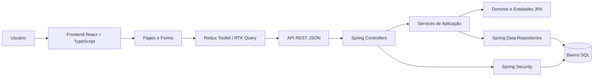

### 1.4 Premissas e Restrições

- O usuário deve estar autenticado para acessar dados financeiros.
- Cada usuário acessa apenas as próprias transações, categorias, saldos e sumários.
- Dados financeiros principais não são persistidos em `localStorage`; a persistência oficial ocorre no banco SQL.
- O frontend pode manter cache temporário para usabilidade, mas deve tratar o backend como fonte de verdade.
- Operações de escrita financeira devem ser transacionais no backend.
- Erros de validação, autenticação, autorização e persistência devem ser retornados em formato padronizado.

## 2. Convenções de Realização

### 2.1 Componentes de Frontend

| Tipo | Responsabilidade |
| --- | --- |
| `Page` | Orquestra a tela, parâmetros de rota, carregamento inicial e composição dos componentes. |
| `Form` | Captura dados do usuário, faz validações imediatas de usabilidade e submete comandos para a API. |
| `Slice` | Mantém estado local da feature quando necessário, como filtros, seleção atual e flags de UI. |
| `API client` | Realiza chamadas HTTP, controla cache, loading, erro, revalidação e invalidação de dados. |

As validações do frontend melhoram a experiência, mas não substituem as validações do backend.

### 2.2 Componentes de Backend

| Tipo | Responsabilidade |
| --- | --- |
| `Controller` | Expõe endpoint REST, recebe DTOs, aplica validação de entrada e delega para services. |
| `DTO` | Representa contrato de entrada e saída da API, sem expor diretamente entidades JPA. |
| `Service` | Executa regras de negócio, coordena repositories e define limites transacionais. |
| `Repository` | Encapsula consultas e comandos de persistência via Spring Data JPA. |
| `Entity` | Modela dados persistidos, relacionamentos, constraints e ownership por usuário. |
| `Security` | Autentica, autoriza, injeta usuário autenticado e protege endpoints. |

### 2.3 Convenções de API

- Endpoints REST usam prefixo `/api`.
- Requisições e respostas usam JSON.
- Respostas de erro seguem um formato consistente, preferencialmente `ProblemDetail` ou equivalente.
- Identificadores pertencentes a outro usuário devem produzir erro de autorização ou recurso não encontrado, evitando vazamento de dados.
- Operações de escrita retornam o recurso criado/atualizado ou um DTO de confirmação com dados relevantes.

## 3. Modelo de Domínio e Persistência

### 3.1 Entidades Principais

| Conceito | Representação Atualizada |
| --- | --- |
| `Usuario` | Dono dos dados financeiros e sujeito autenticado. |
| `Transacao` | Lançamento financeiro com tipo `RECEITA` ou `DESPESA`; substitui o uso isolado de `Gasto` como entidade principal. |
| `Categoria` | Classificação de transações, vinculada ao usuário. |
| `ResumoFinanceiro` ou `Saldo` | Resultado calculado a partir das transações. |
| `SumarioFinanceiro` | Modelo de saída para consultas agregadas simples por período, categoria e tipo de transação. |

### 3.2 Tabelas Relacionais Esperadas

| Tabela | Campos principais | Restrições e índices |
| --- | --- | --- |
| `usuarios` | `id`, `nome`, `email`, `senha_hash`, `criado_em`, `atualizado_em` | `email` único; senha nunca armazenada em texto claro. |
| `categorias` | `id`, `usuario_id`, `nome`, `ativa`, `criado_em`, `atualizado_em` | FK para `usuarios`; nome único por usuário; índice em `usuario_id`. |
| `transacoes` | `id`, `usuario_id`, `categoria_id`, `tipo`, `valor`, `data`, `descricao`, `criado_em`, `atualizado_em` | FK para `usuarios` e `categorias`; `valor > 0`; índice em `usuario_id`, `data`, `tipo` e `categoria_id`. |

### 3.3 Ownership dos Dados

Toda consulta ou alteração deve ser filtrada pelo usuário autenticado. Uma categoria, transação ou sumário só pode ser usado quando os dados de origem pertencem ao identificador presente no contexto de segurança.

## 4. Caso de Uso 01 - Registrar Gasto

### 4.1 Descrição do Caso de Uso

**Objetivo:** permitir que o usuário registre uma nova despesa, associando-a a uma categoria e fazendo com que o saldo consultável reflita a nova movimentação.

**Ator principal:** usuário autenticado.

**Pré-condições:**

- O usuário está autenticado.
- A categoria informada existe, está ativa e pertence ao usuário.

**Pós-condições:**

- Uma `Transacao` do tipo `DESPESA` é persistida.
- O saldo e os resumos financeiros passam a refletir a despesa.

### 4.2 Componentes Participantes

| Camada | Componentes |
| --- | --- |
| Frontend | `TransacoesPage`, `TransacaoForm`, `transacoesSlice`, `transacoesApi` |
| API | `TransacaoController`, `CriarTransacaoRequest`, `TransacaoResponse` |
| Aplicação | `TransacaoService` |
| Persistência | `TransacaoRepository`, `CategoriaRepository`, `UsuarioRepository` |
| Domínio | `Usuario`, `Transacao`, `Categoria`, `TipoTransacao.DESPESA` |
| Banco SQL | `transacoes`, `categorias`, `usuarios` |

> Observação: o termo "gasto" permanece como nome do caso de uso por compatibilidade com o documento original. No domínio, ele é representado por uma `Transacao` do tipo `DESPESA`.

### 4.3 Endpoint Principal

| Método | Endpoint | Autenticação | Descrição |
| --- | --- | --- | --- |
| `POST` | `/api/transacoes` | Obrigatória | Cria uma transação do tipo `DESPESA`. O mesmo recurso pode ser reaproveitado para receitas básicas, mas este caso de uso cobre apenas o registro de gasto. |

Exemplo de entrada:

```json
{
  "tipo": "DESPESA",
  "valor": 85.90,
  "data": "2026-05-14",
  "categoriaId": 12,
  "descricao": "Supermercado"
}
```

### 4.4 Fluxo Principal

1. O usuário abre a tela de transações ou a ação rápida de registrar gasto.
2. `TransacaoForm` coleta valor, data, categoria e descrição.
3. O frontend executa validações imediatas de formato, campos obrigatórios e valor positivo.
4. `transacoesApi` envia `POST /api/transacoes` com o token ou cookie de autenticação.
5. `TransacaoController` valida o DTO com Bean Validation e obtém o usuário autenticado pelo contexto do Spring Security.
6. `TransacaoService`, em método anotado com `@Transactional`, verifica a categoria pelo par `categoriaId` e `usuarioId`.
7. O service cria a entidade `Transacao` com tipo `DESPESA`, valor positivo, data, descrição e vínculos de usuário/categoria.
8. `TransacaoRepository` persiste a transação no banco SQL.
9. O saldo será recalculado por agregação SQL nas consultas de saldo e dashboard.
10. O controller retorna `201 Created` com `TransacaoResponse`.
11. O frontend invalida o cache de transações, saldo e dashboard, e exibe confirmação ao usuário.

### 4.5 Fluxos Alternativos

| Código | Condição | Tratamento |
| --- | --- | --- |
| A1 | Categoria inexistente, inativa ou de outro usuário | Backend retorna erro `404` ou `403`; frontend orienta seleção de outra categoria. |
| A2 | Valor nulo, menor ou igual a zero, ou formato inválido | Backend retorna `400` com detalhes de validação; frontend destaca o campo. |
| A3 | Usuário não autenticado | Spring Security retorna `401`; frontend redireciona para login. |
| A4 | Falha de persistência | Transação SQL é revertida; backend retorna erro padronizado; frontend permite nova tentativa. |

### 4.6 Diagrama de Sequência

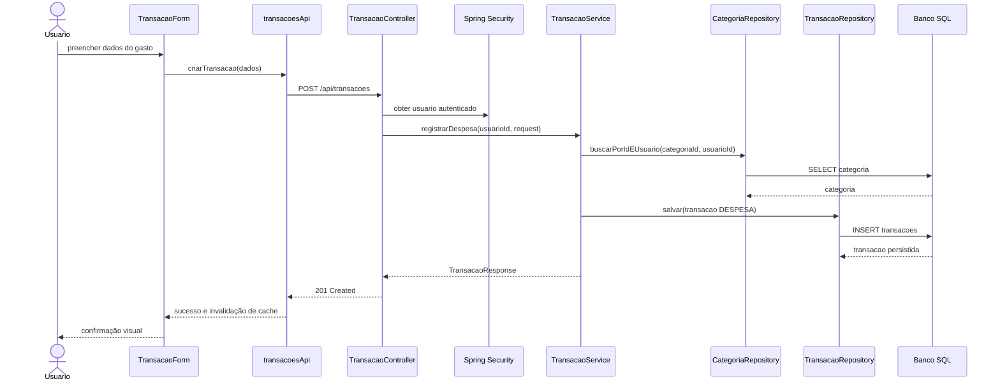

### 4.7 Diagrama de Classes Participantes

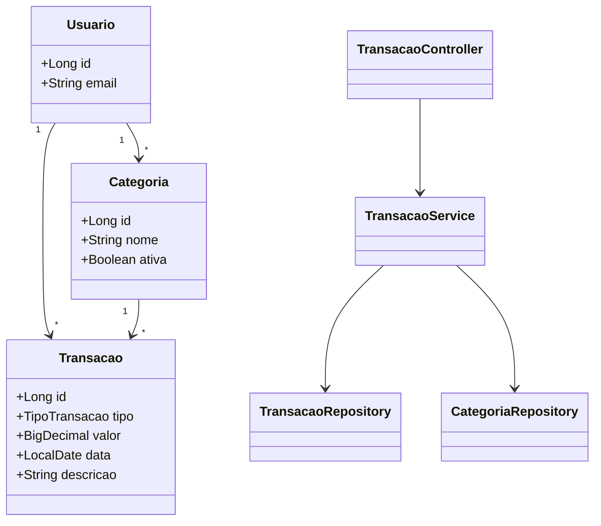

### 4.8 Regras de Negócio

- O usuário deve estar autenticado.
- O valor da despesa deve ser positivo.
- Toda despesa deve estar vinculada a uma única categoria pertencente ao usuário.
- A data deve ser válida e compatível com as regras do produto.
- A persistência da despesa deve ocorrer em uma transação atômica.
- O frontend não pode forçar `usuarioId`; o backend sempre usa o usuário autenticado.

### 4.9 Resultado Esperado

A despesa é persistida no banco SQL, fica disponível para consultas, saldo e dashboard, e o saldo apresentado ao usuário passa a refletir a nova transação.

## 5. Caso de Uso 02 - Consultar Saldo

### 5.1 Descrição do Caso de Uso

**Objetivo:** permitir que o usuário visualize o saldo disponível e um resumo rápido com total de despesas, total de receitas e resultado líquido em um período.

**Ator principal:** usuário autenticado.

**Pré-condições:**

- O usuário está autenticado.
- Existem ou não transações no período consultado; ausência de transações deve retornar totais zerados.

**Pós-condições:**

- O usuário visualiza o saldo e os totais agregados, sem alterar dados persistidos.

### 5.2 Componentes Participantes

| Camada | Componentes |
| --- | --- |
| Frontend | `DashboardPage`, `ResumoFinanceiroCard`, `dashboardSlice`, `resumoApi` |
| API | `ResumoFinanceiroController`, `ResumoFinanceiroResponse`, `PeriodoRequest` |
| Aplicação | `ResumoFinanceiroService` |
| Persistência | `TransacaoRepository` |
| Domínio | `Usuario`, `Transacao`, `ResumoFinanceiro` |
| Banco SQL | `transacoes`, `usuarios` |

### 5.3 Endpoint Principal

| Método | Endpoint | Autenticação | Descrição |
| --- | --- | --- | --- |
| `GET` | `/api/resumos/saldo?dataInicial=YYYY-MM-DD&dataFinal=YYYY-MM-DD` | Obrigatória | Retorna saldo e totais agregados para o usuário autenticado. |

### 5.4 Fluxo Principal

1. O usuário acessa o dashboard ou solicita atualização do saldo.
2. `DashboardPage` monta os parâmetros de período, quando aplicável.
3. `resumoApi` envia `GET /api/resumos/saldo`.
4. `ResumoFinanceiroController` valida o período e identifica o usuário autenticado.
5. `ResumoFinanceiroService` solicita ao `TransacaoRepository` agregações por tipo de transação.
6. O repository executa consulta SQL/JPA filtrada por `usuario_id` e período.
7. O service calcula `totalReceitas`, `totalDespesas` e `saldo = totalReceitas - totalDespesas`.
8. O backend retorna `ResumoFinanceiroResponse`.
9. O frontend atualiza o cache e exibe os valores no dashboard.

### 5.5 Fluxos Alternativos

| Código | Condição | Tratamento |
| --- | --- | --- |
| A1 | Sessão inválida ou expirada | API retorna `401`; frontend redireciona para login. |
| A2 | Período inválido | API retorna `400`; frontend exibe erro nos filtros. |
| A3 | Falha de leitura no banco | API retorna erro padronizado; frontend exibe opção de tentar novamente. |
| A4 | Sem transações no período | API retorna totais zerados e lista vazia, não erro. |

### 5.6 Diagrama de Sequência

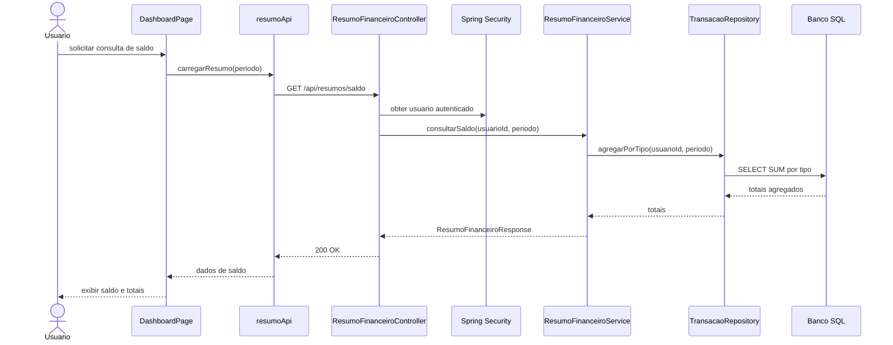

### 5.7 Diagrama de Classes Participantes

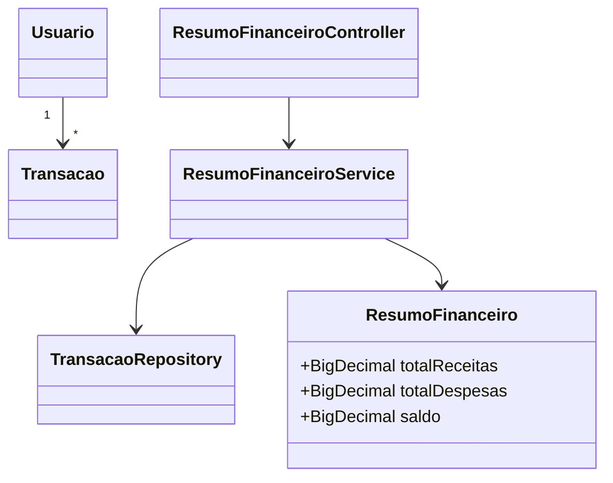

### 5.8 Regras de Negócio

- O usuário deve estar autenticado.
- O saldo é calculado apenas com transações do usuário autenticado.
- Receitas aumentam o saldo e despesas reduzem o saldo.
- O período informado deve ter data inicial menor ou igual à data final.
- Consultas de saldo não devem expor transações, categorias ou totais de outro usuário.

### 5.9 Resultado Esperado

O usuário visualiza saldo, total de receitas, total de despesas e resultado líquido do período, calculados a partir dos dados persistidos no banco SQL.

## 6. Caso de Uso 03 - Cadastrar Categoria

### 6.1 Descrição do Caso de Uso

**Objetivo:** permitir que o usuário crie ou edite categorias para organizar suas transações financeiras.

**Ator principal:** usuário autenticado.

**Pré-condições:**

- O usuário está autenticado.
- Para edição, a categoria deve existir e pertencer ao usuário.

**Pós-condições:**

- A categoria é criada ou atualizada no banco SQL.
- A categoria fica disponível para associação em despesas e receitas, conforme regras do produto.

### 6.2 Componentes Participantes

| Camada | Componentes |
| --- | --- |
| Frontend | `CategoriasPage`, `CategoriaForm`, `categoriasSlice`, `categoriasApi` |
| API | `CategoriaController`, `CategoriaRequest`, `CategoriaResponse` |
| Aplicação | `CategoriaService` |
| Persistência | `CategoriaRepository` |
| Domínio | `Usuario`, `Categoria` |
| Banco SQL | `categorias`, `usuarios` |

### 6.3 Endpoints Principais

| Método | Endpoint | Autenticação | Descrição |
| --- | --- | --- | --- |
| `POST` | `/api/categorias` | Obrigatória | Cria uma categoria do usuário autenticado. |
| `PUT` | `/api/categorias/{id}` | Obrigatória | Atualiza uma categoria existente do usuário autenticado. |
| `GET` | `/api/categorias` | Obrigatória | Lista categorias do usuário autenticado. |

### 6.4 Fluxo Principal de Criação

1. O usuário abre a tela de gerenciamento de categorias.
2. `CategoriaForm` coleta nome e status da categoria quando aplicável.
3. O frontend valida campos obrigatórios.
4. `categoriasApi` envia `POST /api/categorias`.
5. `CategoriaController` valida o DTO e obtém o usuário autenticado.
6. `CategoriaService`, em método `@Transactional`, verifica se já existe categoria com o mesmo nome para o usuário.
7. O service cria a entidade `Categoria` associada ao usuário.
8. `CategoriaRepository` persiste a categoria.
9. O backend retorna `201 Created` com `CategoriaResponse`.
10. O frontend invalida o cache de categorias e exibe confirmação.

### 6.5 Fluxos Alternativos

| Código | Condição | Tratamento |
| --- | --- | --- |
| A1 | Nome duplicado para o mesmo usuário | API retorna `409 Conflict` ou `400`; frontend solicita outro nome. |
| A2 | Categoria de outro usuário em edição | API retorna `404` ou `403`. |
| A3 | Falha de persistência | Transação é revertida e erro padronizado é retornado. |

### 6.6 Diagrama de Sequência

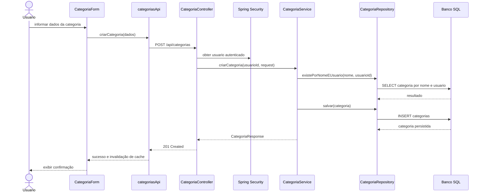

### 6.7 Diagrama de Classes Participantes

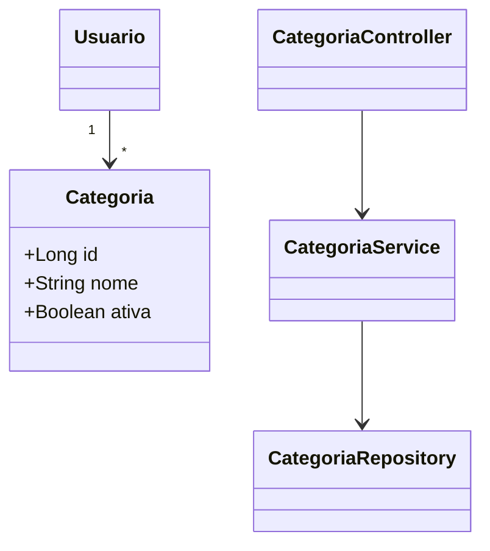

### 6.8 Regras de Negócio

- O usuário deve estar autenticado.
- O nome da categoria deve ser obrigatório e único por usuário.
- Uma categoria usada em transações pode ser inativada em vez de removida fisicamente, para preservar histórico financeiro.
- O backend deve impedir criação, edição ou leitura de categoria pertencente a outro usuário.

### 6.9 Resultado Esperado

A categoria é criada ou atualizada e fica disponível para uso em transações financeiras do usuário.

## 7. Caso de Uso 04 - Autenticar Login

### 7.1 Descrição do Caso de Uso

**Objetivo:** autenticar o usuário no PoupaMais para permitir acesso às funcionalidades protegidas.

**Ator principal:** usuário cadastrado.

**Pré-condições:**

- O usuário possui cadastro ativo.
- O backend possui credenciais armazenadas com hash forte e salt.

**Pós-condições:**

- Uma sessão autenticada é estabelecida por token ou cookie seguro.
- O frontend passa a conseguir chamar endpoints protegidos.

### 7.2 Componentes Participantes

| Camada | Componentes |
| --- | --- |
| Frontend | `LoginPage`, `LoginForm`, `authSlice`, `authApi` |
| API | `AuthController`, `LoginRequest`, `AuthResponse` |
| Segurança | `Spring Security`, `AuthenticationManager`, `PasswordEncoder`, `TokenService` |
| Aplicação | `AutenticacaoService` quando houver camada própria além do Spring Security |
| Persistência | `UsuarioRepository` |
| Domínio | `Usuario` |
| Banco SQL | `usuarios` |

### 7.3 Endpoint Principal

| Método | Endpoint | Autenticação | Descrição |
| --- | --- | --- | --- |
| `POST` | `/api/auth/login` | Pública | Valida credenciais e emite sessão/token. |

Exemplo de entrada:

```json
{
  "email": "usuario@example.com",
  "senha": "senhaInformada"
}
```

### 7.4 Fluxo Principal

1. O usuário informa email e senha na tela de login.
2. `LoginForm` faz validação básica de preenchimento.
3. `authApi` envia `POST /api/auth/login`.
4. `AuthController` recebe `LoginRequest` e delega a autenticação ao Spring Security ou `AutenticacaoService`.
5. `UsuarioRepository` localiza o usuário por email.
6. `PasswordEncoder` compara a senha informada com o hash armazenado.
7. Se as credenciais forem válidas, `TokenService` emite token assinado ou configura cookie seguro.
8. O backend retorna sucesso com dados mínimos do usuário e informações de sessão.
9. `authSlice` atualiza o estado de autenticação do frontend.
10. O usuário é redirecionado para o dashboard.

### 7.5 Fluxos Alternativos

| Código | Condição | Tratamento |
| --- | --- | --- |
| A1 | Usuário não encontrado | API retorna erro genérico de credenciais inválidas. |
| A2 | Senha incorreta | API retorna erro genérico de credenciais inválidas. |
| A3 | Usuário bloqueado ou inativo | API retorna erro apropriado sem expor detalhes sensíveis. |
| A4 | Muitas tentativas falhas | Aplicar bloqueio temporário, atraso progressivo ou rate limit. |
| A5 | Token expirado em chamadas futuras | API retorna `401`; frontend limpa sessão local e redireciona para login. |

### 7.6 Diagrama de Sequência

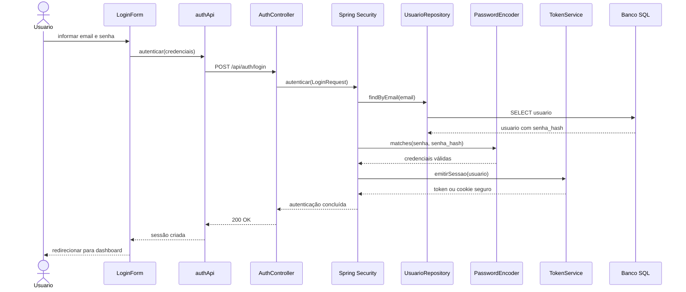

### 7.7 Diagrama de Classes Participantes

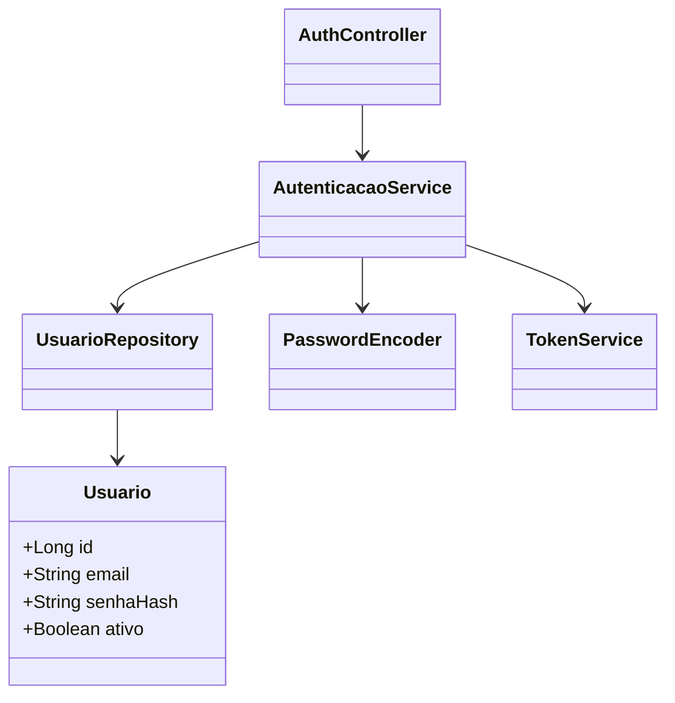

### 7.8 Regras de Negócio e Segurança

- Senhas devem ser armazenadas somente como hash forte com salt, por exemplo BCrypt, Argon2 ou algoritmo equivalente suportado pela política do projeto.
- A resposta de login não deve retornar senha, hash ou dados financeiros.
- Endpoints financeiros devem exigir autenticação.
- O frontend não deve usar `localStorage` como persistência principal de dados financeiros. Para credenciais, a recomendação em aplicações web é cookie `HttpOnly`, `Secure` e `SameSite` quando aplicável.
- Tentativas de login podem ser limitadas para reduzir risco de força bruta.
- Em produção, a autenticação deve trafegar apenas por HTTPS.

### 7.9 Resultado Esperado

O usuário autenticado recebe uma sessão válida e passa a acessar dashboard, transações, categorias, saldo e sumários respeitando as permissões do próprio usuário.

## 8. Caso de Uso 05 - Consultar Sumário Financeiro

### 8.1 Descrição do Caso de Uso

**Objetivo:** consultar um sumário financeiro simples por período, categoria e tipo de transação, permitindo análise básica das finanças do usuário no dashboard.

**Ator principal:** usuário autenticado.

**Pré-condições:**

- O usuário está autenticado.
- Os filtros informados são válidos.

**Pós-condições:**

- O sumário é exibido na interface.
- Nenhum dado financeiro é alterado.

### 8.2 Componentes Participantes

| Camada | Componentes |
| --- | --- |
| Frontend | `DashboardPage`, `SumarioFiltrosForm`, `SumarioResultado`, `dashboardSlice`, `sumariosApi` |
| API | `SumarioFinanceiroController`, `SumarioFinanceiroFiltroRequest`, `SumarioFinanceiroResponse` |
| Aplicação | `ResumoFinanceiroService` |
| Persistência | `TransacaoRepository`, `CategoriaRepository` |
| Domínio | `Usuario`, `Transacao`, `Categoria`, `SumarioFinanceiro` |
| Banco SQL | `transacoes`, `categorias`, `usuarios` |

### 8.3 Endpoints Principais

| Método | Endpoint | Autenticação | Descrição |
| --- | --- | --- | --- |
| `GET` | `/api/resumos/financeiro` | Obrigatória | Retorna dados agregados simples para visualização no dashboard. |

### 8.4 Fluxo Principal

1. O usuário acessa o dashboard ou a área de sumário financeiro.
2. `SumarioFiltrosForm` coleta período, categoria e tipo de transação quando aplicável.
3. O frontend valida formato das datas e campos obrigatórios.
4. `sumariosApi` envia requisição para `/api/resumos/financeiro`.
5. `SumarioFinanceiroController` valida filtros e identifica o usuário autenticado.
6. `ResumoFinanceiroService` monta critérios de consulta filtrados por `usuarioId`.
7. `TransacaoRepository` executa consultas agregadas no banco SQL, agrupando por categoria, tipo ou período, conforme solicitado.
8. `ResumoFinanceiroService` calcula totais, percentuais e séries simples de dados para gráficos.
9. O backend retorna `SumarioFinanceiroResponse` para visualização.
10. O frontend renderiza cartões, tabelas ou gráficos simples no dashboard.

### 8.5 Fluxos Alternativos

| Código | Condição | Tratamento |
| --- | --- | --- |
| A1 | Período inválido | API retorna `400`; frontend destaca os filtros. |
| A2 | Categoria inexistente ou de outro usuário | API retorna `404` ou `403`. |
| A3 | Nenhum dado encontrado | API retorna sumário vazio com totais zerados. |
| A4 | Falha de leitura no banco | API retorna erro padronizado; frontend exibe opção de tentar novamente. |

### 8.6 Diagrama de Sequência

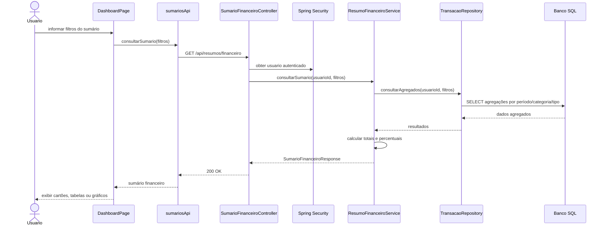

### 8.7 Diagrama de Classes Participantes

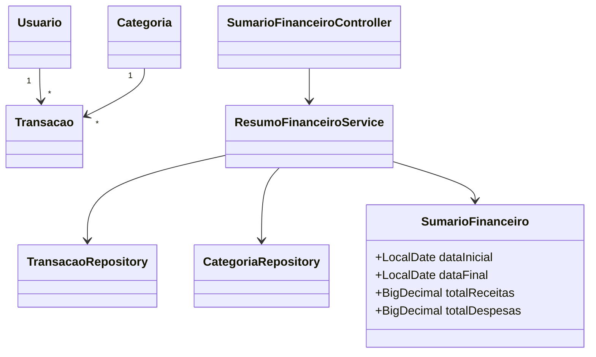

### 8.8 Regras de Negócio

- Sumários devem respeitar o usuário autenticado.
- O período informado deve ser válido.
- Filtros por categoria só podem usar categorias do próprio usuário.
- Totais e percentuais devem considerar o tipo da transação: `RECEITA` ou `DESPESA`.
- Exportações e relatórios assíncronos não fazem parte desta realização da versão 2.0.

### 8.9 Resultado Esperado

O usuário recebe um sumário financeiro correto, filtrado pelos próprios dados, com totais e agrupamentos consistentes com as transações persistidas.

## 9. Observações Técnicas e Considerações de Implementação

### 9.1 Transações e Consistência

- Métodos de escrita financeira, como registrar gasto e criar categoria, devem ser avaliados para uso de `@Transactional`.
- Para registrar gasto, a criação da transação deve ocorrer em uma transação SQL.
- Consultas de saldo e sumário devem ser consistentes com o estado confirmado no banco.
- Caso o sistema use apenas saldo calculado, a consistência depende das transações persistidas e das consultas agregadas.

### 9.2 Validações Server-Side

As validações obrigatórias pertencem ao backend:

- valor monetário positivo;
- categoria existente, ativa e pertencente ao usuário;
- período válido;
- tipo de transação aceito;
- campos obrigatórios;
- autorização por usuário autenticado.

O frontend pode repetir parte dessas validações para reduzir erros antes do envio, mas não deve ser considerado autoridade.

### 9.3 Segurança

- Spring Security protege todos os endpoints financeiros.
- Senhas usam hash forte com salt.
- Dados financeiros são sempre filtrados por usuário.
- APIs devem retornar erros sem revelar detalhes sensíveis.
- Produção deve usar HTTPS.
- CORS deve permitir apenas origens autorizadas.
- Tokens ou cookies devem ter expiração e estratégia de renovação compatível com a política do produto.

### 9.4 Estado Frontend

- Redux Toolkit organiza estado por feature: `auth`, `transacoes`, `categorias`, `dashboard` e `sumarios` quando necessário.
- RTK Query ou camada equivalente gerencia chamadas HTTP, cache e invalidação.
- Após criação de transações, os caches de saldo, dashboard e sumários devem ser invalidados.
- Dados financeiros em cache no navegador são temporários e não substituem o banco SQL.

### 9.5 Tratamento de Erros

| Situação | Resposta Recomendada |
| --- | --- |
| Validação de entrada | `400 Bad Request` com detalhes por campo. |
| Não autenticado | `401 Unauthorized`. |
| Sem permissão ou recurso de outro usuário | `403 Forbidden` ou `404 Not Found`, conforme política de não exposição. |
| Conflito de unicidade | `409 Conflict`. |
| Erro inesperado | `500 Internal Server Error` com mensagem genérica e log interno. |

### 9.6 Testes Recomendados

- Testes unitários de services para regras financeiras e validações.
- Testes de integração de controllers com autenticação e autorização.
- Testes de repositories para agregações de saldo e sumários.
- Testes de segurança para impedir acesso a dados de outro usuário.
- Testes frontend de formulários, estados de loading, erros e sucesso.
- Testes E2E para login, registro de gasto, consulta de saldo, categoria e sumário.

### 9.7 Migrations e Banco de Dados

- O schema SQL deve ser versionado com Flyway, Liquibase ou ferramenta equivalente.
- Constraints de unicidade, FKs e checks devem existir no banco, além das validações de aplicação.
- Índices devem priorizar consultas por `usuario_id`, período, tipo e categoria.
- Dados de teste e seeds, se usados, devem ser separados de dados de produção.

### 9.8 Critérios Gerais de Aceite

- Os cinco casos de uso são executados por API REST protegida.
- O frontend comunica-se com o backend usando contratos JSON claros.
- O backend valida dados e aplica regras de negócio independentemente do frontend.
- Operações financeiras de escrita são transacionais.
- Usuários não conseguem acessar dados financeiros de outros usuários.
- Saldo, dashboard e sumários são calculados a partir de dados persistidos em banco SQL.
- O PDF original permanece inalterado e esta versão Markdown serve como documento revisável da Sprint 3.
