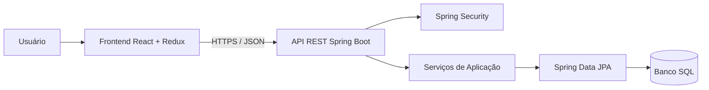

# Documento de Visão do Produto

**Projeto:** PoupaMais  
**Versão:** 2.0  
**Data:** 12 de maio de 2026  
**Documento de origem:** `Especificação do Documento de Visão do Produto.pdf`  
**Equipe:** Equipe de desenvolvimento

## 1. Visão Geral

O PoupaMais é uma aplicação web de controle financeiro pessoal voltada ao registro, consulta e análise básica de despesas, receitas, categorias, saldo e dashboard financeiro.

A solução proposta para esta versão é uma plataforma web completa, composta por frontend em React, TypeScript e Redux, backend Java com Spring Boot e banco de dados SQL relacional. O frontend oferece a experiência de uso, visualizações gráficas e interação com o usuário. O backend concentra autenticação, autorização, regras de negócio, validações críticas, persistência e integração com o banco de dados.

A aplicação deve permitir que cada usuário acompanhe sua vida financeira de forma organizada, com acesso seguro aos seus próprios dados, sincronização entre dispositivos autenticados e sumários gerados a partir de informações persistidas de forma centralizada.

## 2. Problema

Pessoas empreendedoras, assalariadas e estudantes frequentemente têm dificuldade em controlar suas finanças pessoais por falta de uma ferramenta simples, acessível e confiável para registrar movimentações, acompanhar saldo e identificar padrões básicos de gastos.

Entre os problemas recorrentes estão:

- Registro financeiro disperso em planilhas, anotações ou aplicativos pouco intuitivos.
- Falta de visão consolidada de receitas, despesas e saldo por período.
- Baixa disciplina para registrar gastos rapidamente.
- Dificuldade em separar despesas por categoria e identificar excessos.
- Necessidade de acessar os dados em mais de um dispositivo com segurança.
- Risco de perda ou inconsistência quando os dados ficam apenas no navegador.

## 3. Solução

O PoupaMais será implementado como uma aplicação web em camadas. O usuário acessa uma interface responsiva no navegador, autentica-se e utiliza funcionalidades de controle financeiro que consomem uma API REST JSON exposta por um backend Spring Boot. Os dados são armazenados em banco SQL relacional e associados ao usuário autenticado.

A solução contempla:

- Frontend React com TypeScript para telas, formulários, dashboard e gráficos.
- Redux Toolkit, preferencialmente com RTK Query, para estado global, chamadas HTTP, cache, carregamento e erros.
- Backend Java/Spring Boot com API REST para autenticação, transações, categorias, saldo, dashboard e sumários simples.
- Spring Security para autenticação, autorização e proteção dos endpoints.
- Spring Data JPA/Hibernate para acesso ao banco relacional.
- Bean Validation e validações de domínio no backend.
- Banco SQL com tabelas, relacionamentos, chaves estrangeiras, índices, constraints e migrações versionadas.
- Comunicação HTTPS em produção.
- Isolamento dos dados por usuário autenticado.

Cache local no frontend pode ser usado para melhorar experiência de uso, mas não será a fonte principal dos dados financeiros. A autoridade sobre persistência, consistência e regras financeiras será o backend.

## 4. Público-Alvo

O PoupaMais é direcionado a pessoas que precisam organizar finanças pessoais sem depender de ferramentas corporativas complexas.

Perfis prioritários:

- Pessoas assalariadas que desejam acompanhar orçamento mensal.
- Estudantes que precisam controlar despesas recorrentes e limite de gastos.
- Pessoas empreendedoras ou autônomas que acompanham entradas e saídas simples.
- Usuários que valorizam clareza, segurança, acesso multi-dispositivo e resumos objetivos.
- Pessoas que querem substituir controles manuais por uma experiência web organizada.

## 5. Objetivos do Produto

Os principais objetivos do PoupaMais são:

- Registrar despesas e receitas básicas de forma rápida e validada.
- Consultar saldo atualizado com base nas transações persistidas.
- Categorizar transações para facilitar análise financeira.
- Exibir dashboard com totais, estatísticas e gráficos.
- Consultar sumários simples por período, categoria e tipo de transação.
- Permitir acesso seguro aos dados financeiros em dispositivos diferentes.
- Garantir que cada usuário acesse apenas os próprios dados.
- Reduzir risco de perda de dados por meio de persistência centralizada em banco SQL.

## 6. Escopo Funcional

### 6.1 Funcionalidades Principais

| Funcionalidade | Descrição |
| --- | --- |
| Autenticação de usuário | Permitir login, encerramento de sessão e proteção das rotas e endpoints. |
| Gestão de despesas | Registrar e consultar despesas com valor, data, descrição e categoria. |
| Gestão de receitas | Registrar e consultar entradas financeiras básicas. |
| Categorias | Criar, editar, inativar e consultar categorias vinculadas ao usuário. |
| Dashboard | Exibir saldo, totais de receitas e despesas, estatísticas e gráficos. |
| Sumários financeiros | Consultar totais por período, categoria e tipo de transação. |
| Gráficos | Exibir visualizações principais para apoiar a análise financeira. |

Metas financeiras, alertas e relatórios exportáveis permanecem no roadmap, mas não compõem o escopo funcional da versão 2.0.

### 6.2 Requisitos Funcionais

| Código | Requisito |
| --- | --- |
| RF01 | O sistema deve permitir autenticação de usuários antes do acesso aos dados financeiros. |
| RF02 | O sistema deve permitir o registro e a consulta de despesas. |
| RF03 | O sistema deve permitir o registro e a consulta de receitas básicas. |
| RF04 | O sistema deve permitir a criação, edição, inativação e consulta de categorias. |
| RF05 | O sistema deve calcular saldo a partir das receitas e despesas do usuário autenticado. |
| RF06 | O sistema deve exibir dashboard com saldo, totais, estatísticas e gráficos. |
| RF07 | O sistema deve permitir consulta de sumários simples por período, categoria e tipo de transação. |
| RF08 | O sistema deve impedir acesso, alteração ou exclusão de dados pertencentes a outro usuário. |
| RF09 | O sistema deve validar campos obrigatórios, valores monetários, datas e categorias antes de persistir dados. |

## 7. Diferenciais

| Diferencial | Descrição |
| --- | --- |
| Persistência centralizada | Os dados financeiros são armazenados em banco SQL, reduzindo risco de perda por limpeza do navegador ou troca de dispositivo. |
| Acesso multi-dispositivo | O usuário pode acessar seus dados a partir de navegadores diferentes após autenticação. |
| Segurança por usuário | Dados financeiros são vinculados ao usuário autenticado e protegidos por autorização no backend. |
| Consistência transacional | Operações críticas de escrita são tratadas pelo backend com transações de banco. |
| Sumários centralizados | Consultas e agregações simples podem ser processadas no backend sobre dados persistidos. |
| Manutenibilidade | Separação entre frontend, API, regras de negócio e persistência facilita evolução e testes. |
| Interface responsiva | A experiência deve ser adequada para desktop e dispositivos móveis. |
| Visualizações financeiras | Gráficos e indicadores ajudam o usuário a compreender padrões de gasto e evolução do saldo. |

## 8. Tecnologias e Arquitetura

### 8.1 Stack Proposta

| Camada | Tecnologia |
| --- | --- |
| Frontend | React, TypeScript, Vite e Tailwind CSS ou biblioteca visual equivalente definida pelo projeto. |
| Estado e integração HTTP | Redux Toolkit, RTK Query ou camada equivalente para API, cache e estados assíncronos. |
| Gráficos | Recharts ou biblioteca compatível com React. |
| Backend | Java, Spring Boot, Spring Web e API REST JSON. |
| Segurança | Spring Security, hash forte de senha com salt, token ou cookie seguro conforme decisão de implementação. |
| Persistência | Spring Data JPA, Hibernate e banco SQL relacional. |
| Banco de dados | PostgreSQL como referência recomendada, mantendo compatibilidade conceitual com SQL relacional. |
| Validação | Bean Validation no backend e validações complementares no frontend. |
| Migrações | Ferramenta de migração versionada, como Flyway ou Liquibase. |
| Sumários financeiros | Geração a partir de consultas e agregações simples do backend. |
| Testes | Testes unitários, integração de API, repositórios, serviços, segurança, frontend e E2E. |
| Deploy | Frontend estático, backend em ambiente de aplicação e banco SQL gerenciado ou containerizado. |

### 8.2 Visão Arquitetural Resumida

O frontend é responsável por experiência de uso, formulários, feedback visual e chamadas HTTP. O backend é responsável por autenticação, autorização, validação server-side, regras financeiras, transações e persistência.

### 8.3 Modelo de Domínio de Referência

| Conceito | Responsabilidade |
| --- | --- |
| Usuario | Representa o dono dos dados financeiros e sujeito autenticado. |
| Transacao | Representa lançamento financeiro do tipo `RECEITA` ou `DESPESA`, com valor, data, descrição, categoria e usuário. |
| Categoria | Classifica transações e pertence ao usuário quando aplicável. |
| ResumoFinanceiro | Representa resultado calculado a partir de transações, como saldo e totais. |
| SumarioFinanceiro | Representa saída analítica simples por período, categoria e tipo de transação. |

Tabelas esperadas incluem `usuarios`, `categorias` e `transacoes`, com chaves estrangeiras para garantir ownership por usuário e integridade referencial.

## 9. Segurança, Privacidade e Governança de Dados

A privacidade no PoupaMais será tratada por meio de segurança, controle de acesso e governança dos dados, não pela premissa de que os dados permanecem exclusivamente no dispositivo.

Diretrizes:

- Senhas devem ser armazenadas apenas como hash forte com salt.
- Toda operação financeira deve ser executada no contexto de um usuário autenticado.
- Endpoints devem validar autorização e impedir acesso a dados de outros usuários.
- Tráfego em produção deve usar HTTPS.
- Dados de entrada devem ser validados no backend antes de qualquer persistência.
- Respostas de erro devem ser padronizadas e evitar vazamento de detalhes internos.
- Logs devem apoiar auditoria e diagnóstico sem expor dados sensíveis desnecessariamente.
- Backups, retenção e exclusão de dados devem seguir política definida pelo projeto.

## 10. Requisitos Não Funcionais

| Código | Requisito |
| --- | --- |
| RNF01 | A aplicação deve ser responsiva e utilizável em desktop e dispositivos móveis. |
| RNF02 | A API deve responder às operações comuns dentro de tempo adequado para uso interativo. |
| RNF03 | O sistema deve manter integridade dos dados por meio de constraints, chaves estrangeiras e transações. |
| RNF04 | O sistema deve registrar erros relevantes para diagnóstico e suporte. |
| RNF05 | O sistema deve separar configurações por ambiente usando variáveis de ambiente. |
| RNF06 | A aplicação deve possuir cobertura de testes compatível com os fluxos críticos. |
| RNF07 | O frontend deve tratar estados de carregamento, sucesso, erro e sessão expirada. |
| RNF08 | O backend deve validar dados mesmo quando o frontend já tiver validações de formulário. |
| RNF09 | O banco deve possuir índices adequados para consultas por usuário, data, categoria e tipo de transação. |
| RNF10 | O deploy deve permitir ambientes separados de desenvolvimento, homologação e produção quando aplicável. |

## 11. Métricas de Sucesso

| Métrica | Meta inicial |
| --- | --- |
| Tempo médio para registrar uma transação | Menor que 30 segundos após login. |
| Tempo de resposta da API em operações comuns | Preferencialmente abaixo de 500 ms em condições normais de operação. |
| Disponibilidade da aplicação em produção | Meta inicial de 99% após estabilização do MVP. |
| Taxa de erro em operações críticas | Menor que 1% das requisições válidas. |
| Uso recorrente | Mais de 60% dos usuários ativos retornando após 1 mês. |
| Satisfação do usuário | NPS ou métrica equivalente acima de 8/10. |
| Cobertura de testes dos fluxos críticos | Fluxos de autenticação, transações, categorias, saldo e dashboard cobertos. |
| Tempo de carregamento inicial do frontend | Preferencialmente menor que 2 segundos em conexão adequada. |

## 12. Roadmap Simplificado

### MVP Funcional Completo

- Autenticação de usuário.
- Estrutura inicial de frontend React, TypeScript e Redux.
- API REST Spring Boot.
- Banco SQL com migrações versionadas.
- Registro e consulta de despesas e receitas básicas.
- Gestão simples de categorias.
- Cálculo de saldo por usuário.
- Dashboard com totais e gráficos principais.
- Validações no frontend e no backend.
- Testes iniciais de frontend, backend e API.
- Deploy separado de frontend, backend e banco.

### Versão 2.1

- Metas financeiras por categoria ou período.
- Alertas de aproximação ou estouro de metas.
- Melhorias de filtros no dashboard.
- Ampliação dos testes de integração e E2E.

### Versão 2.2

- Relatórios por período, categoria e tipo de transação.
- Exportação de relatórios em PDF ou formato equivalente.
- Melhorias de performance em consultas agregadas.
- Observabilidade básica com logs estruturados e métricas.

### Evolução Futura

- Importação assistida de extratos bancários, sujeita a validação de formato e regras de conciliação.
- Modo escuro.
- Notificações web para lembretes ou alertas, quando compatível com a estratégia de produto.
- Recursos adicionais de recuperação de conta e preferências de usuário.

## 13. Restrições

- A aplicação depende de acesso ao backend para autenticação, persistência e consulta dos dados principais.
- Dados financeiros não devem ser tratados como fonte principal no `localStorage`.
- Operações críticas devem respeitar autorização por usuário.
- O backend deve ser a autoridade para validações financeiras e regras de consistência.
- O uso de cache no frontend não substitui a persistência em banco SQL.
- O projeto deve considerar custos de infraestrutura para backend, banco, observabilidade e deploy.

## 14. Premissas

- O usuário possui navegador moderno com JavaScript habilitado.
- O usuário possui conexão com internet para autenticação e sincronização dos dados.
- O produto será operado como aplicação web online, com tolerância a falhas e tratamento de indisponibilidade.
- O banco SQL será provisionado com política de backup e migrações versionadas.
- O backend Spring Boot será implantado em ambiente com variáveis de configuração por ambiente.
- O frontend consumirá a API por HTTPS em produção.
- O time manterá testes mínimos para os fluxos críticos antes de cada entrega.

## 15. Decisões Arquiteturais

| Decisão | Justificativa |
| --- | --- |
| Usar React com TypeScript | Permite criar uma interface web tipada, componentizada e responsiva. |
| Usar Redux Toolkit | Centraliza estado de sessão, filtros, cache e chamadas assíncronas de forma previsível. |
| Usar Spring Boot | Fornece base madura para API REST, validação, segurança, serviços e integração com banco. |
| Usar Spring Security | Garante autenticação, autorização e proteção de endpoints. |
| Usar Spring Data JPA | Reduz código repetitivo de persistência e padroniza acesso ao banco relacional. |
| Usar banco SQL | Garante integridade, relacionamentos, consultas agregadas e transações para dados financeiros. |
| Separar frontend e backend | Melhora manutenibilidade, segurança, deploy e evolução independente das camadas. |
| Usar migrações versionadas | Mantém evolução do schema rastreável e reproduzível entre ambientes. |

## 16. Critérios de Aceite

O produto será considerado aderente à visão desta versão quando:

- O usuário conseguir autenticar-se e acessar apenas seus próprios dados.
- O usuário conseguir registrar e consultar despesas e receitas básicas.
- O usuário conseguir cadastrar, editar, inativar e consultar categorias.
- O saldo exibido for calculado com base nas transações persistidas do usuário autenticado.
- O dashboard apresentar totais, estatísticas e gráficos coerentes com os dados registrados.
- O sistema impedir valores inconsistentes, datas inválidas, categorias inválidas e acesso a dados de outro usuário.
- Dados financeiros persistirem no banco SQL entre sessões e dispositivos autenticados.
- Operações críticas de escrita forem processadas pelo backend com validações server-side.
- A interface for responsiva em mobile e desktop.
- Erros de API, validação e sessão expirada forem tratados de forma compreensível para o usuário.
- O PDF original permanecer inalterado e a nova versão em Markdown estiver disponível para revisão.
